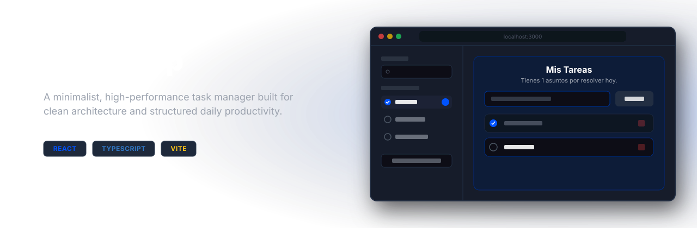

<p align="center">
  <a href="https://ivanepais.github.io/today-app/">
    
  </a>
</p>

Today App | Your Tasks Now.

---

## 💻 App

> 🚀 **Try the app!** follow the link: **[today-app](https://ivanepais.github.io/today-app)** or click on the banner.

---

## 🌟 Features

* **Local Data Persistence:** All tasks are saved in the browser.
* **Fácil de Usar:** A UI designed for visual and usability comfort. It's divided into a section dedicated to search and filtering, leading to the heart of the app: noting what you have to do today! 

---

## 🛠️ Tech Stack

| Category | Tech | Purpose |
| :--- | :--- | :--- |
| **Core Frontend** | React | Building an interface based on modular components. |
| **Language** | TypeScript | Implementation of strict typing to ensure code robustness and prevent development errors. |
| **Builder** | Vite | Ultra-fast development environment with immediate hot-reload and advanced production build optimization thanks to Rolldown, written in Rust. |
| **Styles/CSS** | Styled Components | Encapsulated styles at the component level (CSS-in-JS), facilitating maintenance and avoiding global collisions. |
| **Code Quality** | EsLint & StyleLint | Static analyzers to ensure best coding practices. |
| **Testing Environment** | Vitest & RTL | Modern, high-performance testing suite, fully integrated with the packer's native configuration. |

---

## 🏗️ Architecture & Structure

The project implements a modular approach:

```text
src/
├── components/             # Presentation Layer: User Interface (UI) Components
│   ├── atoms/              # Reusable and indivisible atomic components (Button, Input, etc.)
│   ├── molecules/          # Functional units that combine atomic components
│   ├── organisms/          # Components with full features: they can handle events and internal UI logic
│   ├── pages/              # Intelligent components that bridge the layers of the application
│   └── templates/          # UI structural components of the application
├── core/                   # Domain Layer: defines entities and business rules
│   ├── task.entity.ts      # Define the domain's source of truth, what data is accepted
│   └── task.logic.ts       # Domain behavior: pure functions associated with the entity. Defines how the data will be used
├── hooks/                  # State Layer: Custom Hooks to extract the logic
│   └── useTasks.ts         # Orchestrator between the UI and the system to expose the actions that can be performed in the app
├── services/               # Provides access to data storage.
│   └── storage.service.ts  # A service that enables data persistence       
├── store/                  # Define the Actions: the language with which the user interface communicates with the application state
│   └── task.reducer.ts     # Define the changes that occur in the system
├── styles/                 # Define the styles used in the app
│   ├── GlobalStyles.ts     # Basic style of the application
│   └── theme.ts            # Style tokens that the components will consume
├── App.tsx                 # Root component and application orchestrator
└── main.tsx                # Application entry point and rendering in the DOM
```

---

## 🚀 Local Installation & Implementation

To set up the local development environment and run the application on your computer:

1. **Clone the repo:**
Download the project to your computer.

```sh
git clone https://github.com/ivanepais/today-app.git
```

2. **Access the directory:**
Navigate to the root folder where the project settings are located..

```sh
cd today-app
```

3. **Install dependencies:**
With NodeJS you can download and install all the necessary packages and libraries specified in the configuration file

```sh
npm install
```

4. **Start the development server:**
Start the local server to view and test the application in real time in your browser

```sh
npm run dev
```   

---

**Suite de Pruebas (Testing):**

The project includes automated testing coverage to validate the consistency of business logic and global state transitions.

Run tests in interactive mode (Watch Mode):
Ideal for daily workflow while modifying source code.

```sh
npm run test
```

Run tests in production mode (CI Run)
Perform a single, complete pass of the entire test suite, ideal for continuous integration environments

```sh
npm run test:run
```

## 📄 License

This project is licensed under the MIT License.
See the file [LICENSE](LICENSE) for more details.